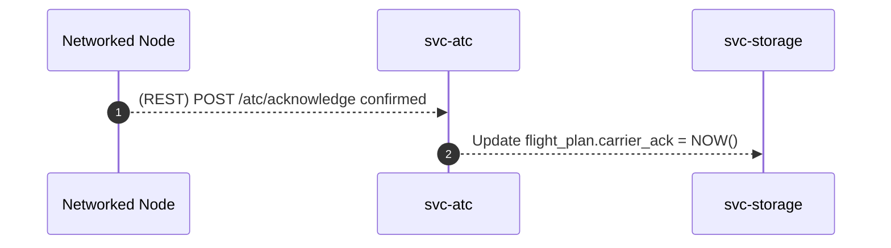
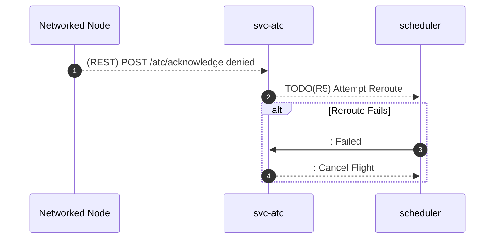
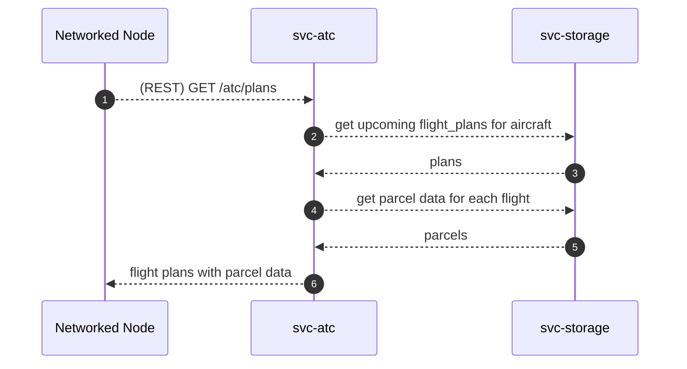

# Software Design Document (SDD) - `svc-atc` 

## :telescope: Overview

This document details the software implementation of `svc-atc`.

This service is an automated air traffic control service responsible for maintaining safe separation of VTOL aircraft.

Attribute | Description
--- | ---
Status | Draft

## :books: Related Documents

Document | Description
--- | ---
[High-Level Concept of Operations (CONOPS)](https://github.com/aetheric-oss/se-services/blob/develop/docs/conops.md) | Overview of Aetheric microservices.
[High-Level Interface Control Document (ICD)](https://github.com/aetheric-oss/se-services/blob/develop/docs/icd.md)  | Interfaces and frameworks common to all Aetheric microservices.
[Requirements - `svc-atc`](https://nocodb.aetheric.nl/dashboard/#/nc/view/1f06e270-d36d-41cb-85ea-25a5d5d60c77) | Requirements and user stories for this microservice.
[Concept of Operations - `svc-atc`](./conops.md) | Defines the motivation and duties of this microservice.
[Interface Control Document (ICD) - `svc-atc`](./icd.md) | Defines the inputs and outputs of this microservice.

## :dna: Module Attributes

Attribute | Applies | Explanation
--- | --- | ---
Safety Critical | Y | Collision avoidance and rerouting.

## :gear: Logic

### Initialization

At initialization this service creates two servers on separate threads: a GRPC server and a REST server.

The REST server expects the following environment variables to be set:
- `DOCKER_PORT_REST` (default: `8000`)

The GRPC server expects the following environment variables to be set:
- `DOCKER_PORT_GRPC` (default: `50051`)

### Loop

As a REST and GRPC server, this service awaits requests and executes handlers.

Some handlers **require** the following environment variables to be set:
- `STORAGE_HOST_GRPC`
- `STORAGE_PORT_GRPC`

This information allows this service to connect to other microservices to obtain information requested by the client.

For detailed sequence diagrams regarding request handlers, see [Interface Handlers](#speech_balloon-interface-handlers).

### Cleanup

No cleanup behavior.

## :speech_balloon: Interface Handlers

### `ack`

Aircraft will confirm that they've received a flight plan.

**Nominal - Carrier Confirms**

**Off-Nominal - Carrier Denies**

### `plans`

Aircraft will request upcoming plans.

